# 流程图与交互图

## 1. 系统架构图

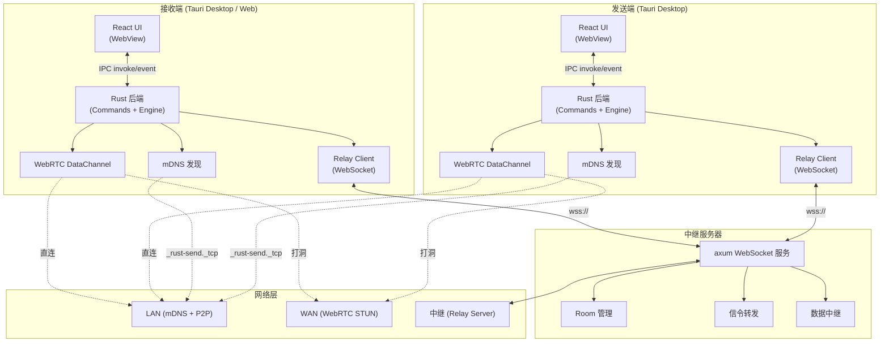

---

## 2. 应用启动流程

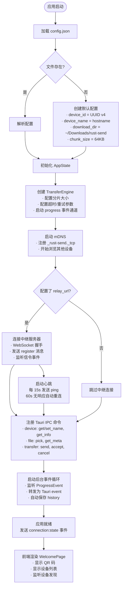

---

## 3. 设备发现流程

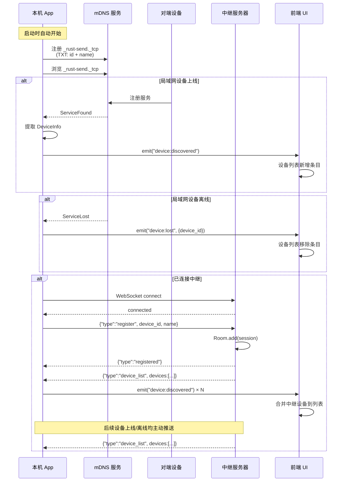

---

## 4. 发送文件完整时序

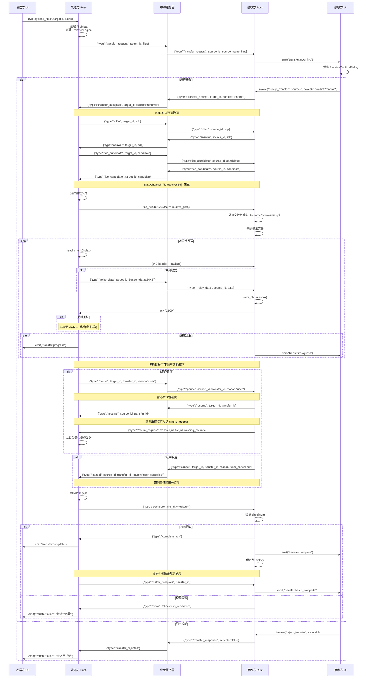

---

## 5. 传输状态机

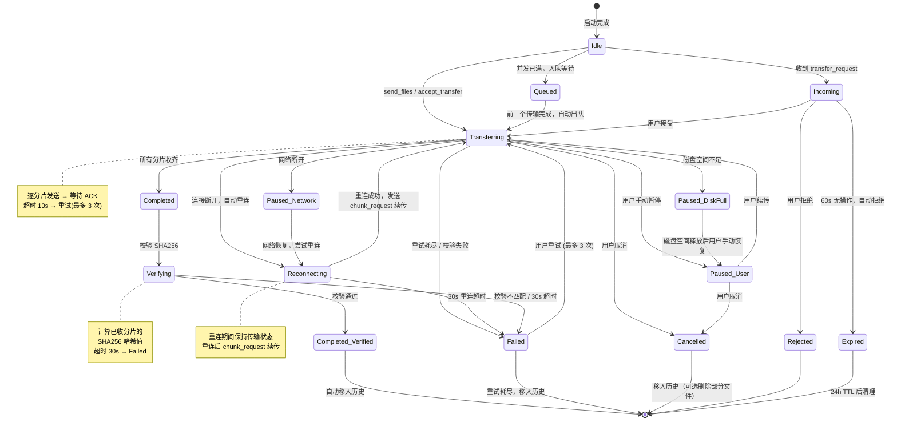

---

## 6. 前后端数据流

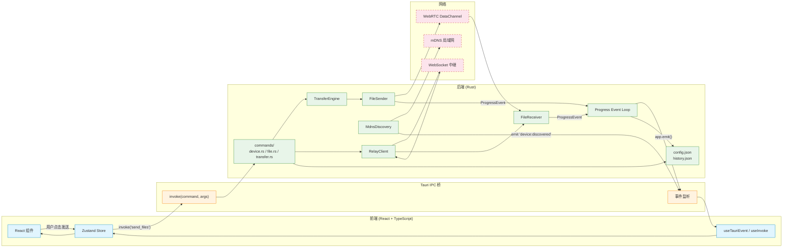

---

## 7. 分片发送内部流程

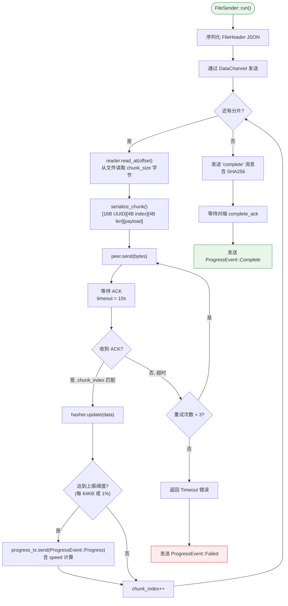

---

## 8. 中继服务器消息处理

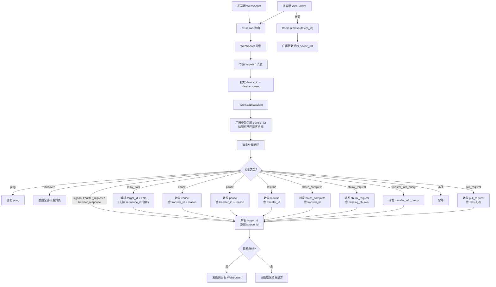

---

## 9. 组件交互图（前端）

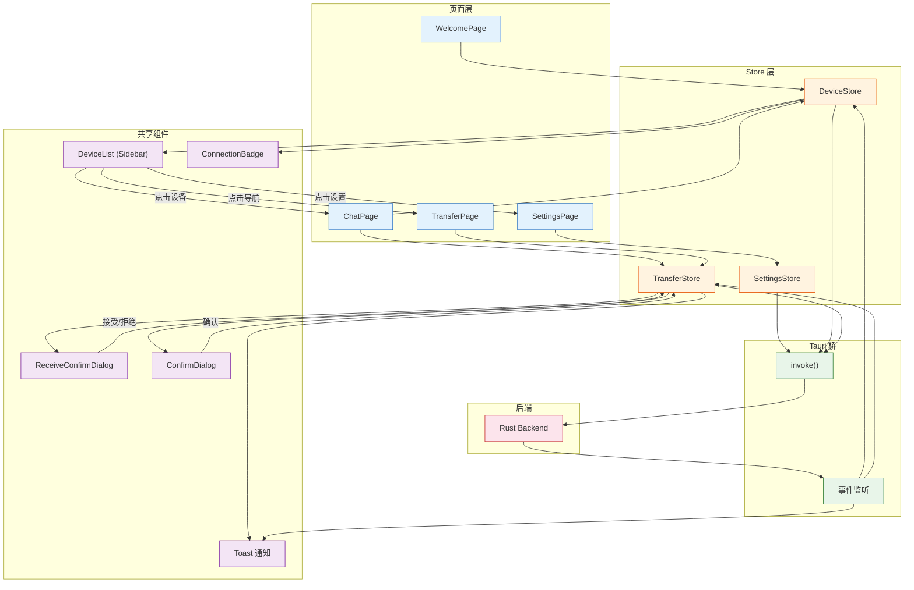

---

## 10. 文件生命周期

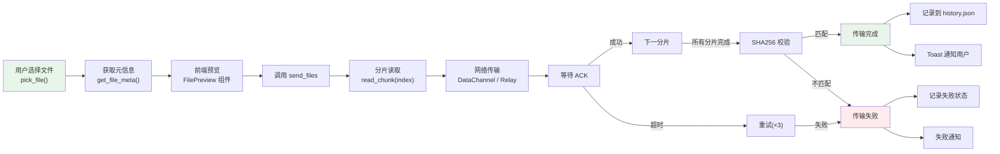

---

## 11. 项目文件结构概览

```mermaid
graph TD
    Root["rust-send/"] --> Src["src/ (React 前端)"]
    Root --> Tauri["src-tauri/ (Rust 后端)"]
    Root --> Relay["relay-server/ (中继服务器)"]
    Root --> Web["web/ (Web 端入口)"]
    Root --> Docs["docs/ (设计文档)"]

    Src --> Comp["components/"]
    Src --> Pages["pages/"]
    Src --> Stores["stores/"]
    Src --> Lib["lib/"]

    Tauri --> Cmds["commands/"]
    Tauri --> Core["core/"]
    Tauri --> Transfer["transfer/"]
    Tauri --> Disc2["discovery/"]
    Tauri --> Relay2["relay/"]
    Tauri --> Plat["platform/"]

    Relay --> WS["ws.rs"]
    Relay --> Room["room.rs"]
    Relay --> Main["main.rs"]

    Docs --> Arch["architecture.md"]
    Docs --> Proto["protocol.md"]
    Docs --> API["api.md"]
    Docs --> CompDoc["components.md"]
    Docs --> PagesDoc["pages.md"]
    Docs --> BackendDoc["backend.md"]
    Docs --> Diagrams["diagrams.md"]

    style Root fill:#37474f,color:#fff
    style Src fill:#e3f2fd
    style Tauri fill:#e8f5e9
    style Relay fill:#fce4ec
    style Docs fill:#fff3e0
```

---

## 附录：流程图索引

| 图号 | 名称 | 用途 |
|------|------|------|
| 1 | 系统架构图 | 整体组件关系、网络层级 |
| 2 | 应用启动流程 | AppState 初始化顺序 |
| 3 | 设备发现流程 | LAN + Relay 两种发现机制 |
| 4 | 发送文件完整时序 | 信令 → WebRTC → 分片 → 完成的全部交互 |
| 5 | 传输状态机 | 传输生命周期的状态迁移 |
| 6 | 前后端数据流 | 数据如何在 React → IPC → Rust → Network 间流动 |
| 7 | 分片发送内部流程 | FileSender 的逐分片处理细节 |
| 8 | 中继服务器消息处理 | Relay Server 的消息路由逻辑 |
| 9 | 组件交互图 | 前端页面/组件/Store 间的关系 |
| 10 | 文件生命周期 | 从选择文件到传输完成的完整路径 |
| 11 | 项目文件结构 | 代码目录结构 |
